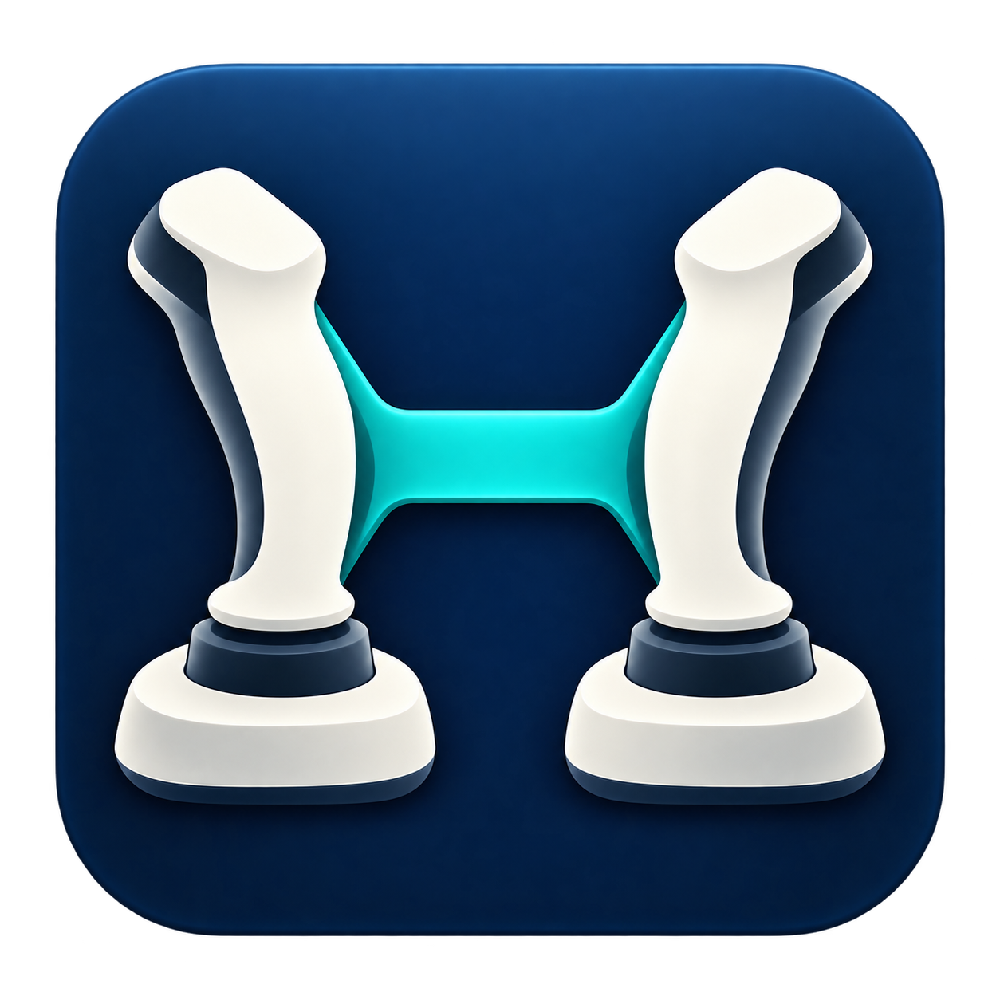

# HOSAS Bridge

[English](README.md) | [Polski](README.pl.md)

**Dwa drążki. Czytelne sterowanie w grze.**

HOSAS Bridge pomaga, gdy gra myli identyczne joysticki. Łączy rozpoznawanie urządzeń, mapowanie, wirtualny kontroler i ukrywanie fizycznych drążków w jednej aplikacji Windows.

**0.9.0-beta.4 — kandydat do publicznej bety, bez podpisu cyfrowego aplikacji.** Właściciel sprawdził wcześniejszą wersję z dwoma T.16000M w WARDOGS. Nowa beta wymaga [odbioru](docs/HARDWARE_ACCEPTANCE.md). Projekt nie jest oficjalnym narzędziem gry ani producentów.

## Możliwości

Rozpoznawanie ruchem, trwały vJoy, konfiguracja HidHide, Hybrid i CombinedVirtual, role drążków/przepustnicy/pedałów, przenośne profile JSON, krzywe reakcji, martwe strefy i kalibracja. MINIGUN odwraca dodatkowo tylko Pitch. PL/EN, zasobnik, autostart i lokalna diagnostyka.

## Pierwsze uruchomienie

1. Pobierz instalator lub ZIP z [GitHub Releases](https://github.com/Metruu1337/HOSAS-Bridge/releases). Jeśli nie ma jeszcze wydania, trwa przygotowanie paczek. Zainstaluj aplikację lub rozpakuj cały ZIP. Instalator aplikacji nie uruchamia instalatorów sterowników. Brakujące sterowniki zainstaluj później w zakładce Devices (Urządzenia). Domyślnym językiem pierwszego uruchomienia jest angielski; polski można wybrać w ustawieniach.
2. W Urządzeniach przejdź kreator: sprawdź sterowniki, doinstaluj brakujące, napraw urządzenie wirtualne i zezwól aplikacji na dostęp przez HidHide.
3. Rozpoznaj prawy i lewy drążek ruchem. Wybierz WARDOGS + Dual T.16000M, uniwersalny HOSAS albo własne ustawienia. Zastosowanie ustawień resetuje strojenie/przycisk trybu — pomiń je, jeśli zachowujesz obecną konfigurację.
4. Przetestuj wejście, opcjonalnie przypisz tryb, napraw ukrywanie i zakończ konfigurację.
5. Uruchom mostek. W WARDOGS przypisz vJoy do Roll/Pitch/Yaw, a fizyczny lewy drążek do Collective.

Sterowniki mogą wymagać administratora i restartu. Aplikacja działa bez podwyższonych uprawnień. Nie uruchamiaj kilku instalatorów naraz ani nie kończ ich siłowo. Wykonaj restart na żądanie instalatora. Wersja przenośna też potrzebuje sterowników; zmiana folderu wymaga ponownego zezwolenia w HidHide.

## Zgodność

| Zestaw | Stan | Uwagi |
|---|---|---|
| Dwa T.16000M + WARDOGS, wcześniejsza wersja | SPRAWDZONY PRZEZ WŁAŚCICIELA | Osie i rozgrywka; nie pełny odbiór bety |
| Ten sam zestaw z nową betą | OCZEKUJE NA ODBIÓR | Lista testów ręcznych |
| Inne kontrolery DirectInput | SPODZIEWANA ZGODNOŚĆ | Potrzebne mapowania/testy |
| VKB, Virpil, pedały, inne gry | NIEPRZETESTOWANE | Brak gwarancji |

## Zaufanie i bezpieczeństwo

Bez wstrzykiwania DLL, pamięci gry, rejestrowania klawiatury, modyfikacji gry i automatyzacji rozgrywki. Bez telemetrii i wysyłania danych; normalna praca nie wymaga internetu.

Otwarty kod nie potwierdza sam pochodzenia EXE. Proces z tagu tworzy sumy SHA-256, SBOM i poświadczenie tam, gdzie obsługuje je GitHub. Lokalne kompilacje są oznaczone. Aplikacja/instalator nie są podpisane; sterowniki mają osobne podpisy producentów. Nie gwarantujemy zgodności z każdym anti-cheatem.

[Bezpieczeństwo](docs/SECURITY_AND_TRUST.pl.md) · [FAQ](docs/community/FAQ.pl.md) · [Kompilacja](BUILDING.md) · [Pomoc](TROUBLESHOOTING.md) · [Licencje](THIRD-PARTY-NOTICES.md)

Licencja MIT. Dziękujemy autorom vJoy, HidHide, Vortice i .NET.

## Gamepads / Pady

Xbox / XInput and PlayStation (DualShock 4, DualSense) presets: [setup, mapping and limitations / konfiguracja i ograniczenia](docs/GAMEPADS.md). Physical gamepad acceptance is pending / testy na fizycznych padach pozostają do wykonania.
